# Claude Command Examples

Docs can be found [here](https://docs.claude.com/en/docs/claude-code/slash-commands)

---

---

description: Smart semantic search with natural language
argument-hint: <search_query>
model: claude-sonnet-4-20250514

---

## Search Query Analysis

**User's Original Query**: "$ARGUMENTS"

### Query Optimization

Claude, analyze the query above and improve it for code search:

1. **If vague** (e.g., "that parsing thing") → Make it specific (e.g., "language parser implementation")
2. **If a question** (e.g., "how does parsing work?") → Extract keywords (e.g., "parsing implementation process")
3. **If conversational** (e.g., "the stuff that handles languages") → Use technical terms (e.g., "language handler processor")
4. **If too broad** (e.g., "errors") → Add context (e.g., "error handling exception management")

**YourOptimizedQuery**: _{Claude: Write your improved query here, then use it below}_

---

### Semantic Search with Context

Execute this command with your optimized query:

```bash
codanna mcp semantic_search_with_context query:"{YourOptimizedQuery}" limit:5
```

### Alternative: Full-Text Search

If semantic search needs different keywords, try this (use your optimized query):

```bash
codanna retrieve search "{YourOptimizedQuery}" --limit 10
```

**Instructions for Claude**:

1. First, write an optimized version of the user's query
2. Replace `{YourOptimizedQuery}` in both commands with your optimized query
3. Execute the semantic search command
4. If results are poor, try adjusting the query and searching again
5. **For follow-up questions**: If the user asks related questions or wants to explore further, repeat this entire workflow:
   - Analyze their new query using the same optimization process
   - Execute new searches with the optimized query
   - Use the search results to answer their question
   - Continue this cycle for as many iterations as needed
6. **For saving findings**: When the user says something like "save what we learned", "save report", "create a summary", or similar requests:
   - **IMMEDIATELY use the Write tool** to save to: `reports/find/find-{short-semantic-slug}.md`
   - Create a well-formatted markdown report using the template structure below
   - Include: Original query, key findings, relevant code locations, insights discovered
   - Use clear headings, code snippets, and file references with line numbers
   - Make it a comprehensive reference document for future use
   - **DO NOT just display the report - actually save it to the file**

**Date**:
!`date '+%B %d, %Y at %I:%M %p'`

---

## Report Template

**IMPORTANT**:Use this structure for all find command reports:

```markdown
# Find Report: {Descriptive Title}

**Generated**: {Date}
**Original Query**: "{User's original search query}"
**Optimized Query**: "{Your optimized query}"

## Summary

Brief overview of what was discovered and the main purpose of the search.

## Key Findings

### Primary Discoveries

- **Finding 1**: Description with file reference (`src/file.rs:123`)
- **Finding 2**: Description with file reference (`src/other.rs:456`)
- **Finding 3**: etc.

### Code Locations

| Component        | File                | Line | Purpose           |
| ---------------- | ------------------- | ---- | ----------------- |
| ComponentName    | `src/path/file.rs`  | 123  | Brief description |
| AnotherComponent | `src/other/file.rs` | 456  | Brief description |

## Notable Findings

### Interesting Patterns

- Pattern or architecture insight discovered
- Unexpected implementation detail
- Connection between different parts of the codebase

### Code Quality Observations

- Well-designed aspects noticed
- Areas that could benefit from attention
- Performance considerations observed

## Claude's Assessment

### Honest Feedback

- How well does this code accomplish its purpose?
- What are the strengths of the current implementation?
- Any potential concerns or areas for improvement?

### Recommendations

- **For developers**: Actionable suggestions for working with this code
- **For architecture**: Higher-level structural recommendations
- **For maintenance**: Things to keep in mind for future changes

## Search Journey

### Query Evolution

1. Original: "{original query}"
2. Optimized: "{optimized query}"
3. Follow-ups: (if any additional searches were performed)

### Search Results Quality

- Semantic search effectiveness: {High/Medium/Low}
- Full-text search needed: {Yes/No}
- Total relevant results found: {Number}

## Related Areas

### Connected Components

- List of related files/modules that weren't directly searched but are connected
- Suggestions for future exploration

### Follow-up Questions

- What questions remain unanswered?
- What would be good next steps for deeper understanding?

---

_This report was generated using the `/find` command workflow._
_Claude version: [your model version]_
```

**IMPORTANT**:
Save report to: `@reports/find/find-{short-semantic-slug}.md`

---

---

description: Analyze dependencies of a symbol
argument-hint: <symbol_name>
model: claude-opus-4-1-20250805

---

## Dependency Analysis Workflow

**TargetSymbol**: "$ARGUMENTS"

### My Analysis Approach

Claude, I need to understand the dependency structure of this symbol. Here's my workflow:

1. **First, verify the symbol exists** - Get complete information about what we're analyzing
2. **Map direct dependencies** - What does this symbol depend on (calls it makes)?
3. **Map reverse dependencies** - What depends on this symbol (who calls it)?
4. **Check for implementations** - If it's a trait/interface, who implements it?
5. **Synthesize insights** - Analyze coupling, stability, and refactoring opportunities
6. **Generating Report** - Save the complete analysis report as a markdown file at @reports/deps/"$ARGUMENTS"-dependencies.md

---

### Step 0: Preparation

_"The user asked about '$ARGUMENTS'. I need to replace {TargetSymbol} with '$ARGUMENTS' in all the commands below."_

For example, if the user typed `/deps OutputManager`, then:

- Replace `{TargetSymbol}` with `OutputManager` in every command
- The actual command becomes: `codanna retrieve describe OutputManager --json`

### Step 1: Symbol Verification

_"Let me first check if this symbol exists and understand what it is..."_

```bash
codanna retrieve describe {TargetSymbol} --json | jq -r 'if .status == "success" then
  "Symbol: \(.item.symbol.name) (\(.item.symbol.kind))\nLocation: \(.item.file_path)\nModule: \(.item.symbol.module_path)\nVisibility: \(.item.symbol.visibility)\n\nDocumentation:\n\(.item.symbol.doc_comment // "No documentation")\n\nSignature:\n\(.item.symbol.signature)"
else
  "Symbol not found: {TargetSymbol}"
end'
```

If the symbol doesn't exist, stop here and inform the user.

### Step 2: Direct Dependencies Analysis

_"Now I'll see what this symbol depends on (what it calls)..."_

```bash
codanna retrieve calls {TargetSymbol} --json | jq -r 'if .status == "success" then
  "Direct dependencies (\(.count) total):\n" +
  (.items[:10] | map("  - \(.symbol.name) (\(.symbol.kind)) at \(.file_path)") | join("\n"))
else
  "No direct dependencies found (may not be a callable symbol)"
end'
```

### Step 3: Reverse Dependencies Analysis

_"Let me check what depends on this symbol (who calls it)..."_

```bash
codanna retrieve callers {TargetSymbol} --json | jq -r 'if .status == "success" then
  "Reverse dependencies (\(.count) callers):\n" +
  (.items[:10] | map("  - \(.symbol.name) (\(.symbol.kind)) at \(.file_path)") | join("\n"))
else
  "No callers found (may be an entry point or unused)"
end'
```

### Step 4: Implementation Check (if applicable)

_"If this is a trait or interface, let me find its implementations..."_

```bash
codanna retrieve implementations {TargetSymbol} --json | jq -r 'if .status == "success" then
  "Implementations (\(.count) total):\n" +
  (.items | map("  - \(.symbol.name) at \(.file_path)") | join("\n"))
else
  "No implementations (not a trait/interface or no implementors)"
end'
```

Note: This returning "not found" is expected for non-traits.

### Step 5: Deep Code Analysis (Important!)

_"Let me examine the actual implementation of key methods to understand the real dependencies..."_

For structs with methods, get the file paths and line ranges:

```bash
codanna retrieve describe {TargetSymbol} --json | jq -r 'if .item.relationships.defines then
  "Key methods to examine:\n" +
  (.item.relationships.defines[:3] | map("  - \(.name) at \(.file_path // "src/unknown.rs"):\(.range.start_line)-\(.range.end_line + 10)") | join("\n"))
else
  "No methods to examine"
end'
```

**Claude: Based on the line ranges above, READ THE ACTUAL CODE of 2-3 key methods:**

- For example, for constructors (`new`, `with_*`): Read to understand what dependencies are injected
- For main public methods: Read to see what they actually call internally
- Look for: field initialization, method calls, trait usage, error handling patterns

Example action you should take:

```
If you see "new at src/indexing/simple.rs:100-150", then:
Use the Read tool: Read(file_path="src/indexing/simple.rs", offset=100, limit=50)
```

This code reading is **CRUCIAL** for understanding actual dependencies that `retrieve calls` might miss!

### Step 6: Caller Context Analysis

_"For the top callers, let me see HOW they actually use this symbol..."_

```bash
codanna retrieve callers {TargetSymbol} --json | jq -r 'if .status == "success" and .count > 0 then
  "Top caller contexts to examine:\n" +
  (.items[:10] | map("  - \(.symbol.name) at \(.file_path):\(.symbol.range.start_line)-\(.symbol.range.end_line + 5)") | join("\n"))
else
  "No callers to examine"
end'
```

**Claude: READ 1-2 of the top callers to understand usage patterns:**

- How is this symbol instantiated or called?
- What parameters/config are passed?
- What's done with the return value?
- Are there patterns of usage across callers?

---

### Report Template:

<template>

# Dependency Analysis Report: {Descriptive Title}

**TargetSymbol**: "$ARGUMENTS"
**Generated**: !`date '+%B %d, %Y at %I:%M %p'`

## Summary

Brief overview of what was discovered and the main purpose of the search.

## Key Findings

After running the commands above, provide a comprehensive analysis:

## Dependency Structure for {SYMBOL}

### Overview

Based on the JSON data retrieved:

- **Symbol Type**: [Extract from kind field]
- **Location**: [Extract from file_path]
- **Purpose**: [Extract from doc_comment]
- **Visibility**: [Extract from visibility field]

### Dependency Metrics

From the JSON counts:

- **Direct Dependencies**: [count from calls] symbols this depends on
- **Reverse Dependencies**: [count from callers] symbols that depend on this
- **Coupling Level**:
  - 0-5 dependencies each way = Low coupling
  - 6-15 dependencies each way = Medium coupling
  - 16+ dependencies each way = High coupling

### Key Findings

1. **Stability Assessment**

   - Many callers + few calls = Stable foundation (good for interfaces)
   - Few callers + many calls = Unstable/volatile (refactor candidate)
   - High both ways = Central hub (refactor carefully)

2. **Impact Analysis**
   Look at the actual callers list and identify:

   - Test vs production code (files containing "test" vs others)
   - Critical paths (main functions, API handlers)
   - Module boundaries crossed

3. **Coupling Patterns**
   From the dependency lists, identify:
   - Tightly coupled clusters (multiple symbols from same module)
   - Cross-module dependencies (different module_path values)
   - Circular dependencies (if A calls B and B appears in A's callers)

### Refactoring Recommendations

Based on the dependency patterns observed:

1. **Decoupling Opportunities**

   - If many dependencies are from one module, consider dependency injection
   - If crossing many module boundaries, consider a facade pattern

2. **Interface Segregation**

   - If this has 10+ methods (for structs), consider splitting
   - If callers only use subset of functionality, create focused interfaces

3. **Testing Priority**
   - With X callers, changes need regression testing
   - Focus on testing the top 5 callers first

### Risk Assessment

- **Change Risk**: Based on caller count

  - 0-5 callers = Low risk
  - 6-20 callers = Medium risk
  - 20+ callers = High risk

- **Complexity Risk**: Based on dependency count
  - 0-10 dependencies = Low complexity
  - 11-30 dependencies = Medium complexity
  - 30+ dependencies = High complexity

**Recommended Action**: [Synthesize based on both risks]

### Dependency Graph

```mermaid
graph TB
    %% Subgraphs for logical grouping
    subgraph "Upstream Dependencies"
        Caller1["📥 CallerName1<br/><i>module::path</i>"]
        Caller2["📥 CallerName2<br/><i>module::path</i>"]
        Caller3["📥 CallerName3<br/><i>module::path</i>"]
    end

    %% Target symbol in the middle layer
    Target["🎯 {TargetSymbol}<br/><b>Type: struct/trait/fn</b><br/><i>module::path::here</i>"]

    subgraph "Downstream Dependencies"
        Dep1["📤 DependencyName1<br/><i>module::path</i>"]
        Dep2["📤 DependencyName2<br/><i>module::path</i>"]
        Dep3["📤 DependencyName3<br/><i>external::crate</i>"]
    end

    %% Connections with labels
    Caller1 -->|"calls"| Target
    Caller2 -->|"implements"| Target
    Caller3 -->|"uses"| Target

    Target -->|"depends on"| Dep1
    Target -->|"imports"| Dep2
    Target -->|"external"| Dep3

    %% Styling with semantic meaning
    Target:::target
    Caller1:::internal
    Caller2:::internal
    Caller3:::internal
    Dep1:::internal
    Dep2:::internal
    Dep3:::external

    classDef target fill:#ff6b6b,stroke:#000,stroke-width:3px,color:#000,font-weight:bold
    classDef internal fill:#4ecdc4,stroke:#000,stroke-width:2px,color:#000
    classDef external fill:#ffd93d,stroke:#000,stroke-width:2px,color:#000,stroke-dasharray: 5 5
    classDef test fill:#95e77e,stroke:#000,stroke-width:2px,color:#000
    classDef critical fill:#ff4757,stroke:#000,stroke-width:3px,color:#fff
```



_This report was generated using the `/deps` command workflow._
_Claude version: [your model version]_

</template>

---

**Instructions for Claude**:

1. Execute each command in sequence, replacing {TargetSymbol} with the actual symbol name
2. Use the mental cues (in italics) to guide your thinking
3. The JSON output is processed by jq to show readable summaries
4. Interpret the actual numbers and patterns from the JSON data
5. Provide actionable insights based on the real dependency counts and patterns
6. Save the complete analysis report as a markdown file at `@reports/deps/{TargetSymbol}-[short-semantic-slug]-dependencies.md`
7. Include a "Dependency Graph" section with a Mermaid diagram showing:
   - The target symbol in the center
   - Direct dependencies (what it calls) with arrows pointing FROM the symbol
   - Reverse dependencies (what calls it) with arrows pointing TO the symbol
   - Use different colors/styles for different dependency types
